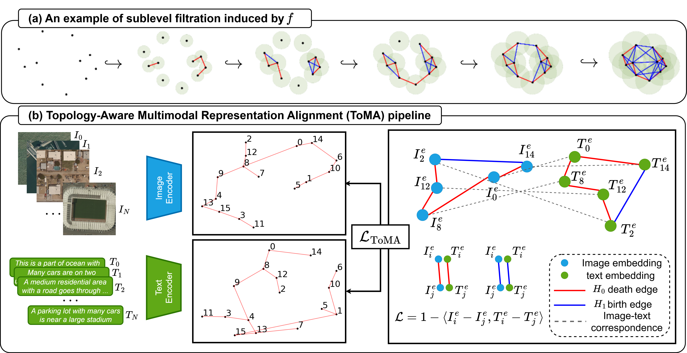

# Topology-Aware Representation Alignment for Semi-Supervised Vision-Language Learning
Implementation of the paper "Topology-Aware Representation Alignment for Semi-Supervised Vision-Language Learning".

## Abstract
Vision-language models have shown strong performance, but they often generalize poorly to specialized domains. 
While semi-supervised vision-language learning mitigates this limitation by leveraging a small set of labeled image-text pairs together with abundant unlabeled images, existing methods remain fundamentally pairwise and fail to model the global structure of multimodal representation manifolds.
Existing topology-based alignment methods rely on persistence diagram matching, which neither guarantees geometric alignment nor utilizes the image-text pairing information central to vision-language learning.
We propose Topology-Aware Multimodal Representation Alignment (ToMA), a framework that uses persistent homology to identify topologically salient edges and aligns them across modalities through available cross-modal correspondences. 
ToMA leverages both $H_0$-death edges and lightweight $H_1$-birth edges, allowing it to capture both connectivity and cycle structure without constructing 2-simplices. 
Experiments show that ToMA yields stable gains, with clear improvements on remote sensing and modest but consistent benefits on fashion retrieval.
Additional analysis shows that ToMA is more stable than alternative topology-based objectives and that lightweight $H_1$-birth edges provide useful higher-order structural signals.

## Method


## Overview

This repository contains the code used to train and evaluate:
- **SemiCLIP** baselines
- **ToMA** (topology-aware alignment)
- **ToMA-domain** (domain-wise topology-aware alignment)

The experiments cover:
- **Remote sensing**
  - in-distribution semi-supervised setting
  - distribution-shift semi-supervised setting
- **Fashion**
  - semi-supervised setting on Fashion200k, FashionGen, and Polyvore

## Repository structure

```text
.
├── main.py
├── environment.yml
├── README.md
├── data/
├── custom/
├── training/
├── keywords/
│   ├── RS/
│   └── fashion/
├── scripts/
│   ├── train_rs_stage1_2.sh
│   ├── train_rs_shift_stage1_2.sh
│   ├── train_fashion_stage1_2.sh
│   ├── eval_RS_stage2.sh
│   └── eval_fashion_stage2.sh
└── scripts_semiclip/
    ├── train_rs_stage1.sh
    ├── train_rs_stage2.sh
    ├── train_fashion_stage1.sh
    └── train_fashion_stage2.sh
```

## Tested environment

The code was prepared and tested in the following environment:

* Ubuntu Linux
* Python 3.9
* PyTorch with CUDA support
* NVIDIA A100 GPU

Create the conda environment with:

```bash
conda env create --file environment.yml
conda activate toma
```

## Data preparation

All scripts assume the dataset root is:

```bash
./data/
```

Please place the datasets under `./data/` so that the training and evaluation scripts can find them through:

```bash
--data-dir "./data/"
```

A recommended structure is:

```text
data/
├── aerial/
│   ├── RSICD/
│   ├── UCM_captions/
│   ├── Sydney_captions/
│   ├── RESISC45/
│   ├── WHU-RS19/
│   ├── RSSCN7/
│   └── AID/
├── fashion/
│   ├── fashion200k/
│   ├── FashionGen/
│   └── PolyvoreOutfits/
└── ...
```

Please make sure that the downloaded files, captions, and split files are arranged so that they match the expected names used by the codebase and scripts.

## Running the experiments

### 1. SemiCLIP baselines

#### Remote sensing

```bash
bash scripts_semiclip/train_rs_stage1.sh
bash scripts_semiclip/train_rs_stage2.sh
```

#### Fashion

```bash
bash scripts_semiclip/train_fashion_stage1.sh
bash scripts_semiclip/train_fashion_stage2.sh
```

### 2. ToMA / ToMA-domain

#### Remote sensing

```bash
bash scripts/train_rs_stage1_2.sh
bash scripts/train_rs_shift_stage1_2.sh
```

#### Fashion

```bash
bash scripts/train_fashion_stage1_2.sh
```

## Evaluation

### Remote sensing

```bash
bash scripts/eval_RS_stage2.sh
```

This script evaluates:

* zero-shot classification on:

  * `RSICD-CLS`
  * `UCM-CLS`
  * `WHU-RS19`
  * `RSSCN7`
  * `AID`
* image-text retrieval on:

  * `RSICD`
  * `UCM`
  * `Sydney`

### Fashion

```bash
bash scripts/eval_fashion_stage2.sh
```

This script evaluates:

* zero-shot classification on:

  * `Fashion200k-CLS`
  * `Fashion200k-SUBCLS`
  * `FashionGen-CLS`
  * `FashionGen-SUBCLS`
  * `Polyvore-CLS`
* image-text retrieval on:

  * `Fashion200k`
  * `FashionGen`
  * `Polyvore`

**Important:** before running `scripts/eval_fashion_stage2.sh`, please fill the `ckpts` array in that script with the checkpoint names produced by training.

## Dataset download links

### Remote sensing

* [Baidupan](http://pan.baidu.com/s/1bp71tE3)
* [GoogleDrive](https://drive.google.com/open?id=0B1jt7lJDEXy3aE90cG9YSl9ScUk)
* [UCM_captions-BaiduPan](https://pan.baidu.com/s/1mjPToHq)
* [Sydney_captions-BaiduPan](https://pan.baidu.com/s/1hujEmcG)
* [UCM_captions-MEGA](https://mega.nz/folder/wCpSzSoS#RXzIlrv--TDt3ENZdKN8JA)
* [RSICD-MEGA](https://mega.nz/folder/EOpjTAwL#LWdHVjKAJbd3NbLsCvzDGA)
* [Sydney_captions-MEGA](https://mega.nz/folder/pG4yTYYA#4c4buNFLibryZnlujsrwEQ)
* [RESISC45](https://www.kaggle.com/datasets/aqibrehmanpirzada/nwpuresisc45)
* [WHU-RS19](https://huggingface.co/datasets/jonathan-roberts1/WHU-RS19)
* [RSSCN7](https://github.com/palewithout/RSSCN7)
* [AID](https://huggingface.co/datasets/blanchon/AID)

### Fashion

* [Fashion200k](https://drive.google.com/drive/folders/0B4Eo9mft9jwoamlYWFZBSHFzV3c?resourcekey=0-2s7M82p8Bn7riqxWVlgctw)
* [Fashion200k mirror (women.tar.gz)](https://www.kaggle.com/datasets/mayukh18/fashion200k-dataset?select=women)
* [FashionGen](https://www.kaggle.com/datasets/bothin/fashiongen-validation?resource=download)
* [PolyvoreOutfits](https://huggingface.co/datasets/mvasil/polyvore-outfits)
* [Polyvore JSON files](https://drive.google.com/drive/folders/1rmSfvKcTvVLugBWFNFtIDZuQwRPGr87U)

## Acknowledgment

This implementation builds on publicly available codebases from prior semi-supervised vision-language learning projects. We thank the authors of:

* [S-CLIP](https://github.com/alinlab/s-clip)
* [SemiCLIP](https://github.com/Gank0078/SemiCLIP)

for making their code publicly available.
